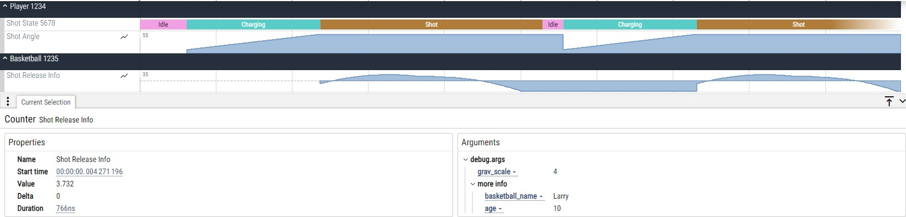
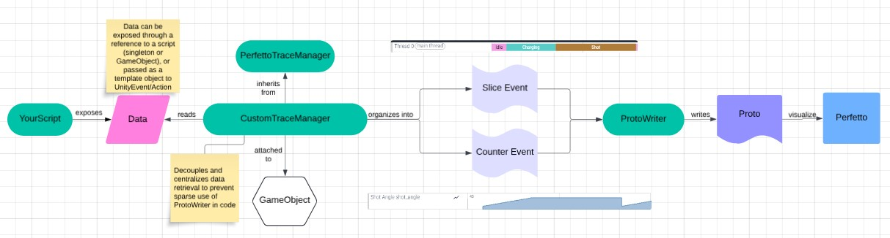

# UnityPerfetto

**UnityPerfetto** is a lightweight, performant C# Unity to [Perfetto](https://perfetto.dev/) util library for your tracing needs.

Demo project included in repo uses [TaroDev's 2D PlayerController](https://github.com/Matthew-J-Spencer/Ultimate-2D-Controller) (different from example below)

<br />


## Features ✨:  
* Leverage all of Perfetto's built in tooling (SQL querying, large trace analysis, and more) 🛠️
* Clear visually grouped **Publishers**, which can visualize data through **Slices** (intervals of time) ⏳ and/or **Counters** (instantaneous) 📉  
* Decoupled design with provided `PerfettoTraceManager` to prevent populating codebase with messy ad hoc benchmarking code 🧹 
* Easily attach metadata to any event with `PerfettoDictionary` 🏷️  
* Multithreaded to avoid overhead from writing to file ⚡️
* Protobuf serialized (native to Perfetto meaning robust extensibility and 50%+ smaller than JSON) 📦



---

## How it works 🔧

1. Download the `.unitypackage` file from releases and import it into your Unity Project
2. Create your own trace manager by inheriting from `PerfettoTraceManager` (this class manages the lifespan of `ProtoWriter` which is a singleton that handles serialization of your data).  
3. Expose your data through callbacks (e.g., `UnityEvent` and `UnityAction`) and register them in a `override` of `PerfettoTraceManager`'s abstract `ExtendInit()` method and unregister them in an `override` of `PerfettoTraceManager`'s abstract `ExtendEnd()` method.  
4. Currently, **UnityPerfetto** is only designed to visualize a single stream of info per publisher. For any data you would like visualized,
   choose between creating a:  
    1. **Slice Publisher** (Visualizes an interval of time. Useful for identifying states) ⏳  
    2. **Counter Publisher** (Visualizes an instantaneous value. Useful for identifying magnitudes of values) 📉  
5. After steps 1-3, your class might look like this:  

```csharp
using UnityEngine.Events;
using UnityPerfetto;
using UnityPerfetto.Protos;

public class ProtoBasketballBenchmarkManager : PerfettoTraceManager
{
    private UnityAction<ShotManager.ShotState> _onShotStateChange;
    private UnityAction<float> _onShotCharging;
    private UnityAction<float, float> _onShotReleased;

    private SlicePublisher _shotStatePublisher;
    private CounterPublisher _shotAnglePublisher;
    private CounterPublisher _shotReleasedInfoPublisher;

    public ShotManager shotManager;

    protected override void ExtendInit()
    {
        _onShotStateChange = (ShotManager.ShotState data) =>
        {
            HandleShotStateChange(data);
        };

        _onShotCharging = (float shotAngle) =>
        {
            HandleShotCharging(shotAngle);
        };

        _onShotReleased = (float basketballYPos, float gravityScale) =>
        {
            HandleShotReleased(basketballYPos, gravityScale);
        };

        _shotStatePublisher = PerfettoPublisherFactory.Instance.CreateSlicePublisher(
                                        "Shot State",
                                        "Player");
        _shotAnglePublisher = PerfettoPublisherFactory.Instance.CreateCounterPublisher(
                                        "Shot Angle",
                                        "Player");
        _shotReleasedInfoPublisher = PerfettoPublisherFactory.Instance.CreateCounterPublisher(
                                        "Shot Release Info",
                                        "Basketball");

        shotManager.onShotStateChange.AddListener(_onShotStateChange);
        shotManager.onShotCharging.AddListener(_onShotCharging);
        shotManager.onShotReleased.AddListener(_onShotReleased);
    }

    protected override void ExtendEnd()
    {
        shotManager.onShotStateChange.RemoveAllListeners();
        shotManager.onShotCharging.RemoveAllListeners();
        shotManager.onShotReleased.RemoveAllListeners();
    }
}
```
5. To log data out, just call the respective LogEvent method for your publisher:
    1. `LogStartEvent(string eventName, string categories, double timestamp)` or `LogEndEvent(double timestamp)` for **Slice Publisher**
       ```csharp
       _shotStatePublisher.LogStartEvent(newState.ToString(), "player_info", _shotStatePublisher.GetTimeStamp());
       ```
    2. `LogCounterEvent(double timestamp, double value)` for **Counter Publisher**
       ```csharp
       _shotAnglePublisher.LogCounterEvent(_shotAnglePublisher.GetTimeStamp(), shotAngle);
       ```
6. (Optional) Both `LogStartEvent` and `LogCounterEvent` have an additional optional argument `args` which can take in a `PerfettoDictionary`
   for additional non visualized metadata.

---

### Adding Metadata 🔍

Package additional metadata using `PerfettoDictionary`.  
Example (see screenshot above for visual result):  

```csharp
private void HandleShotReleased(float basketballYPos, float gravityScale)
{
    PerfettoDictionary dict = new PerfettoDictionary();
    dict["grav_scale"] = gravityScale;
    dict["more info", "basketball_name"] = "Larry";
    dict["more info", "age"] = "10";
    _shotReleasedInfoPublisher.LogCounterEvent(_shotAnglePublisher.GetTimeStamp(), basketballYPos, dict);
}
```

---

### Nesting Events Properly

For `SlicePublisher`s, events must nest properly (meaning no partial overlap between events). Events are ended from most recent to oldest
(from when the event was started):  
```csharp
private void HandleShotStateChange(ShotManager.ShotState newState)
{
    if (_isFirstStateLogged)
    {
        _shotStatePublisher.LogEndEvent(_shotStatePublisher.GetTimeStamp());
    }
    else
    {
        _isFirstStateLogged = true;
    }

    _shotStatePublisher.LogStartEvent(newState.ToString(), "player_info", _shotStatePublisher.GetTimeStamp());
    prevShotState = newState;
}
```

---

### Bringing It All Together 🎮

1. Add your new `BenchmarkManager` script to any GameObject.  
2. Enable it as needed.  
3. When your game exits, open the generated `.pb` file in [Perfetto's UI](https://ui.perfetto.dev/#!/info) and profit! 💰
4. (Optional) If you want a human readable version of your output, look into using [Perfetto's trace conversion tool](https://perfetto.dev/docs/quickstart/traceconv)

---

### Full Example
```csharp
using System;
using UnityEngine.Events;
using UnityPerfetto;
using UnityPerfetto.Protos;

public class ProtoBasketballBenchmarkManager : PerfettoTraceManager
{
    private UnityAction<ShotManager.ShotState> _onShotStateChange;
    private UnityAction<float> _onShotCharging;
    private UnityAction<float, float> _onShotReleased;

    private SlicePublisher _shotStatePublisher;
    private CounterPublisher _shotAnglePublisher;
    private CounterPublisher _shotReleasedInfoPublisher;

    public ShotManager shotManager;

    protected override void ExtendInit()
    {
        _onShotStateChange = (ShotManager.ShotState data) =>
        {
            HandleShotStateChange(data);
        };

        _onShotCharging = (float shotAngle) =>
        {
            HandleShotCharging(shotAngle);
        };

        _onShotReleased = (float basketballYPos, float gravityScale) =>
        {
            HandleShotReleased(basketballYPos, gravityScale);
        };

        // Register publishers using the appropriate publisher type
        _shotStatePublisher = PerfettoPublisherFactory.Instance.CreateSlicePublisher(
                                            "Shot State",
                                            "Player");
        _shotAnglePublisher = PerfettoPublisherFactory.Instance.CreateCounterPublisher(
                                            "Shot Angle",
                                            "Player");
        _shotReleasedInfoPublisher = PerfettoPublisherFactory.Instance.CreateCounterPublisher(
                                            "Shot Release Info",
                                            "Basketball"
                                     );

        // Add listeners to the ShotManager events
        shotManager.onShotStateChange.AddListener(_onShotStateChange);
        shotManager.onShotCharging.AddListener(_onShotCharging);
        shotManager.onShotReleased.AddListener(_onShotReleased);
    }

    protected override void ExtendEnd()
    {
        shotManager.onShotStateChange.RemoveAllListeners();
        shotManager.onShotCharging.RemoveAllListeners();
        shotManager.onShotReleased.RemoveAllListeners();
    }

    private bool _isFirstStateLogged = false;
    private ShotManager.ShotState prevShotState;

    private void HandleShotStateChange(ShotManager.ShotState newState)
    {
        // End previous duration event if this is not the first state logged
        if (_isFirstStateLogged)
        {
            _shotStatePublisher.LogEndEvent(_shotStatePublisher.GetTimeStamp());
        }
        else
        {
            _isFirstStateLogged = true;
        }

        // Start a new duration event for the current state
        _shotStatePublisher.LogStartEvent(newState.ToString(),
                                          "player_info",
                                          _shotStatePublisher.GetTimeStamp());

        prevShotState = newState;
    }

    private void HandleShotCharging(float shotAngle)
    {
        // Log the current shot angle as a counter event
        _shotAnglePublisher.LogCounterEvent(_shotAnglePublisher.GetTimeStamp(), shotAngle);
    }

    private void HandleShotReleased(float basketballYPos, float gravityScale)
    {
        // Log the basketball height and associated gravity scale, along with some other
        // categorized verbose info
        PerfettoDictionary dict = new PerfettoDictionary();
        dict["grav_scale"] = gravityScale;
        dict["more info", "basketball_name"] = "Larry";
        dict["more info", "age"] = "10";
        _shotReleasedInfoPublisher.LogCounterEvent(_shotAnglePublisher.GetTimeStamp(),
                                                   basketballYPos, dict);
    }
}
```

Happy tracing! 🎉  
